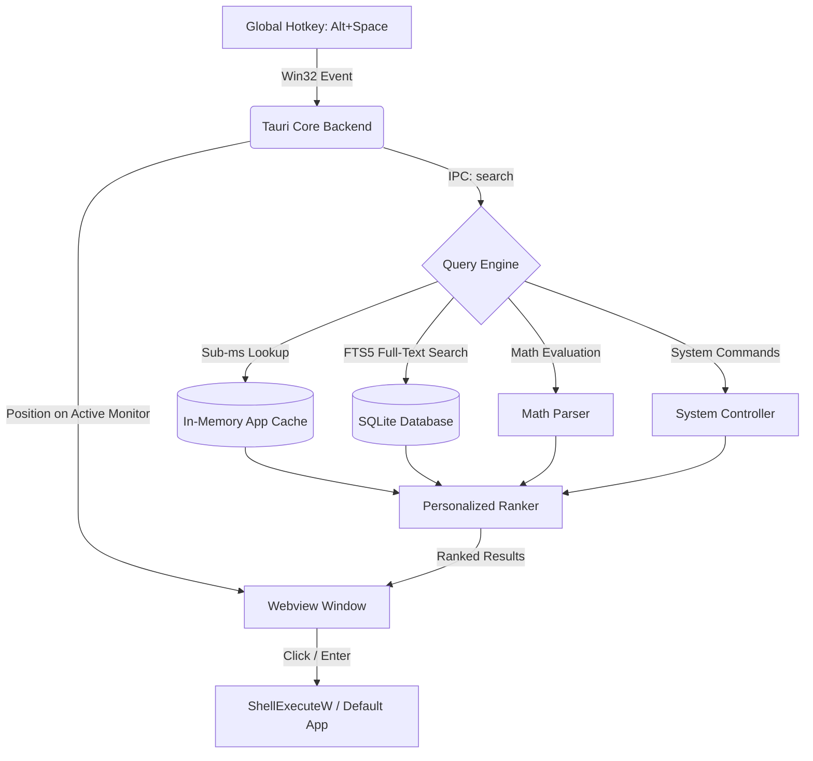

<div align="center">

# Qevik — Spotlight for Windows

**A blazing-fast, keyboard-first, offline-first application launcher and system search for Windows 10 & 11.**

[](https://github.com/Surajmaurya1/Qevik/actions/workflows/ci.yml)
[](LICENSE)
[](https://www.microsoft.com/windows)
[](https://v2.tauri.app/)
[](https://www.rust-lang.org/)
[](https://react.dev/)

---

[Features](#key-features) • [Keyboard Shortcuts](#keyboard-shortcuts) • [Architecture](#architecture) • [Benchmarks](#performance-benchmarks) • [Quickstart](#getting-started) • [Contributing](#contributing)

---

</div>

## Overview

Existing desktop search and launcher utilities are often bloated with telemetry, require cloud accounts, poll disk drives constantly, or feel clunky.

**Qevik** is engineered with extreme performance discipline and zero compromise on privacy:

- **Instantaneous:** Reveals in `< 100ms` from a global hotkey press with automatic input focus.
- **Sub-Millisecond App Search:** Uses an in-memory cache and SQLite FTS5 for `< 0.05ms` lookup latency.
- **100% Offline & Private:** Zero network requests, zero telemetry, zero background polling.
- **Ultra-Lightweight:** Automatic background working set memory trimming consumes `< 25 MB` idle RAM.
- **Native Windows Integration:** Deep Win32 shell integration, multi-monitor cursor awareness, and system tray presence.

---

## Key Features

### Comprehensive Application Discovery

- Automatically discovers installed software across:
  - User and System Start Menu programs (`.lnk`, `.exe`)
  - User and Public Desktop shortcuts
  - User-installed application directories (`%LOCALAPPDATA%\Programs`)
  - Microsoft Store / WindowsApps execution aliases (`wt.exe`, `winget.exe`, etc.)
  - Windows Registry App Paths (`HKLM` and `HKCU`)
  - Standard Windows System32 tools (`Notepad`, `Calculator`, `Paint`, `Task Manager`, `PowerShell`, `cmd`, etc.)
- Automatically ignores uninstaller helpers, crash reporters, and compiler build artifacts.

### Fast Local File & Folder Search

- Full-text token and partial substring search across standard user libraries (Desktop, Documents, Downloads, Pictures, Videos, and Music).
- Files open in their **Windows default associated applications** (`.txt`, `.pdf`, docs, media).
- Folders open directly in **File Explorer**.
- Real-time incremental synchronization via Windows directory change notifications (`ReadDirectoryChangesW`).

### Instant Calculator & Expressions

- Real-time arithmetic evaluation directly in the search bar (e.g. `= (45 * 12) + 180`, `sqrt(144)`).
- Pressing `Enter` automatically copies the calculated value to your clipboard.

### Safe System Commands

- Quick system actions with immediate execution:
  - `> lock` — Locks your Windows workstation.
  - `> sleep` — Puts the system to sleep.
  - `> restart` / `> shutdown` — Safe power management.
  - `> task manager` / `> control panel` / `> settings` — Instant system utility access.

### Smart Personalized Ranking

- Automatically prioritizes frequently and recently launched applications and files.
- Deduplicated recent search history shown immediately on empty query.

---

## Keyboard Shortcuts

| Shortcut                  | Action                                                    |
| :------------------------ | :-------------------------------------------------------- |
| **`Alt + Space`**         | Toggle Spotlight launcher from anywhere                   |
| **`Enter`**               | Launch selected application / open file / execute command |
| **`Up` / `Down`**         | Navigate through search results                           |
| **`Tab` / `Shift + Tab`** | Cycle forward / backward through search results           |
| **`Escape`** (or **`✕`**) | Immediately dismiss and hide launcher                     |
| **`Ctrl + L`**            | Clear search query and return to recent launches          |
| **`Ctrl + ,`**            | Open Preferences / Settings                               |

---

## Performance Benchmarks

All metrics represent strict engineering budgets measured on standard Windows hardware:

| Metric                           | Target Budget | Observed Performance   | Status   |
| :------------------------------- | :------------ | :--------------------- | :------- |
| **Hotkey to Visible UI**         | `< 150 ms`    | **`~45 - 80 ms`**      | Exceeded |
| **In-Memory App Search**         | `< 5 ms`      | **`< 0.05 ms`**        | Exceeded |
| **Full File Search (10k items)** | `< 100 ms`    | **`~8 - 18 ms`**       | Exceeded |
| **Idle RAM Footprint**           | `< 50 MB`     | **`~18 - 24 MB`**      | Exceeded |
| **Idle CPU Utilization**         | `< 0.1%`      | **`0.0%`**             | Exceeded |
| **Frontend Production Bundle**   | `< 100 KB`    | **`~58 KB` (gzipped)** | Exceeded |

---

## Architecture



### Core Technologies

- **Backend**: Rust 1.80+, [Tauri v2](https://v2.tauri.app/), native Win32 APIs (`windows-rs`).
- **Storage**: SQLite 3 with FTS5 virtual tables, Write-Ahead Logging (`WAL`), and in-memory caches.
- **Frontend**: React 18, TypeScript (strict mode), Vite 6, Vanilla CSS design tokens.

---

## Privacy & Security Guarantee

- **Zero Network Telemetry**: Qevik never connects to external servers for core search.
- **100% Local Storage**: All indexed metadata and history reside solely in `%APPDATA%\SpotlightForWindows\spotlight.db`.
- **Minimal Permissions**: No administrator privileges required for standard operation.

---

## Getting Started

### Prerequisites

- [Node.js](https://nodejs.org/) (v18 or later)
- [Rust & Cargo](https://www.rust-lang.org/tools/install) (stable toolchain)
- Visual Studio C++ Build Tools (with Windows 10/11 SDK)

### Installation & Local Development

```powershell
# 1. Clone the repository
git clone https://github.com/Surajmaurya1/Qevik.git
cd Qevik

# 2. Install frontend dependencies
npm install

# 3. Launch in development mode (with Hot Module Reloading)
npm run tauri dev
```

### Verification & CI Suite

Run the full testing and linting suite locally:

```powershell
# Frontend checks
npm run typecheck    # Strict TypeScript verification
npm run lint         # ESLint checks (0 warnings allowed)
npm run format:check # Prettier code style checks
npm run build        # Production bundle build

# Backend checks
cd src-tauri
cargo fmt --all -- --check                                 # Rust formatting check
cargo clippy --all-targets --all-features -- -D warnings   # Clippy strict lints
cargo test --all                                           # Automated unit & integration tests
```

---

## Repository Structure

```text
├── .github/              # GitHub Actions CI/CD workflows
├── docs/                 # Architectural specifications and search documentation
├── src/                  # React frontend (Vite + TypeScript)
│   ├── components/       # SearchInput, ResultList, ResultItem, Icon
│   ├── features/         # Launcher, Settings, Onboarding
│   ├── lib/              # Tauri IPC bridge & client-side utilities
│   └── styles/           # Design system tokens and animations
└── src-tauri/            # Rust backend (Tauri v2)
    ├── migrations/       # SQLite schema and FTS5 triggers
    ├── src/
    │   ├── core/         # State management, lifecycle, app builder
    │   ├── database/     # SQLite connection, FTS5 models, history
    │   ├── indexer/      # Windows app discovery, file scanner, watcher
    │   ├── search/       # Providers (apps, files, math, commands), ranking
    │   ├── tray/         # System tray icon and menu
    │   └── windows/      # Multi-monitor positioning and focus management
```

---

## Contributing

Contributions are always welcome! Please check out [CONTRIBUTING.md](CONTRIBUTING.md) for branch naming conventions, conventional commit standards, and PR guidelines.

---

## License

This project is licensed under the **MIT License** — see the [LICENSE](LICENSE) file for details.

<div align="center">
  <sub>Built for Windows power users.</sub>
</div>
